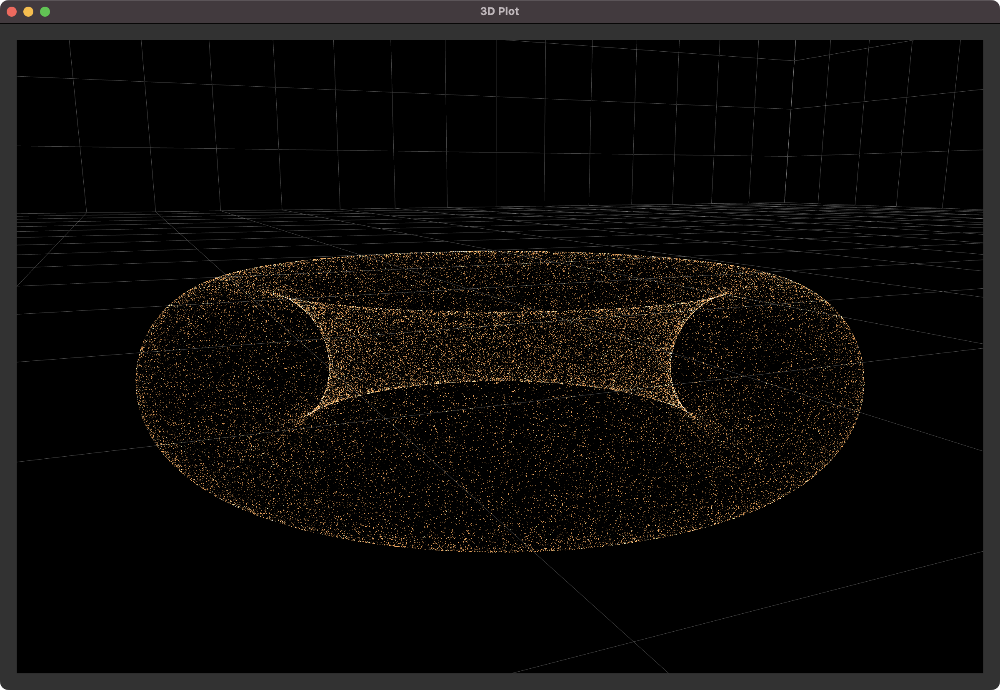

# pyqtgraph-3d-example
This is a simple example of how to use pyqtgraph to create a 3D scatter plot. This example uses PyOpenGL which can draw many number of points.

```shell
pip install -r requirements.txt
python main.py
```


